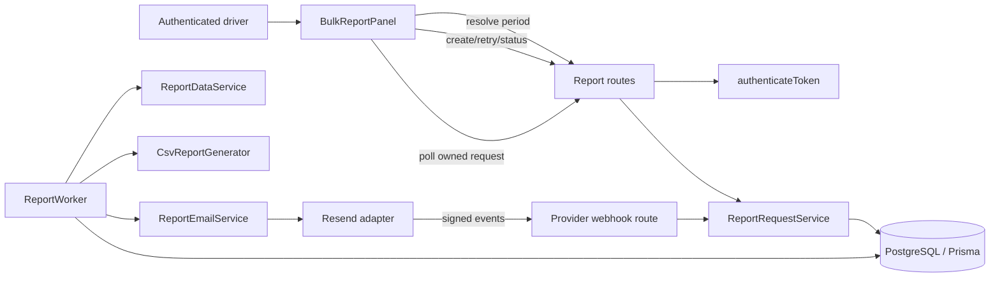

# Technical Design: Bulk CSV Report Email

## Overview

The feature adds an authenticated, asynchronous report workflow to the existing delivery-income dashboard. A driver selects `weekly` or `monthly` and one date, reviews the server-resolved inclusive period and immutable account recipient, then submits one durable report request. The backend snapshots all matching owned delivery entries, generates a safe UTF-8 CSV, submits one email, and reports success only after provider delivery confirmation.

The current repository provides the foundations but not this lifecycle. `DashboardPage.tsx` uses local React state and the typed `api.ts` fetch clients; Express mounts authenticated routes in `src/index.ts`; `authenticateToken` supplies `userId` and email; `IncomeService` scopes reads by `userId`; and Prisma stores `DeliveryEntry` money as `Decimal(12,2)` and `entryDate` as PostgreSQL `DATE`. The existing `GET /api/income-entries/export` is synchronous and intentionally not reused because it uses floating-point projections, dashboard filters, LF records, incomplete report content, and no formula protection, persistence, email, or delivery state.

### Goals

- Meet Requirements 1–8 without changing existing dashboard filtering, totals, entry CRUD, or CSV download behavior.
- Make ownership, recipient selection, snapshot immutability, exactly-once logical submission, and terminal-state rules enforceable in database transactions.
- Keep date-only and monetary calculations exact and independently testable.
- Survive API/worker restarts through PostgreSQL-backed jobs and state.
- Expose a responsive, keyboard-operable, assistive-technology-friendly interaction.

### Non-goals

- Physical printing, arbitrary recipient addresses, scheduled/recurring reports, report download APIs, report sharing, or changes to dashboard filter semantics.
- Claiming inbox placement or message opening; `sent` means the provider emitted delivery confirmation to the recipient mail system.

### Research Findings and Design Consequences

- The repository has no email SDK, queue, report tables, timezone field, structured logger, or property-testing library. These are explicit additions rather than hidden reuse.
- Prisma `Decimal` is currently converted to JavaScript `number` by `IncomeService`; reports instead retain `Decimal` values so `0.00` and exact sums are preserved.
- The account has no timezone. Add an IANA `timeZone` to `User`, defaulting existing MYR-oriented accounts to `Asia/Kuala_Lumpur`; the server-stored value is authoritative and is copied to each request.
- CSV follows the required CRLF/quote grammar, consistent with [RFC 4180](https://www.rfc-editor.org/rfc/inline-errata/rfc4180.html). Formula neutralization is applied before CSV quoting because spreadsheet formula injection is a recognized risk ([OWASP CSV Injection](https://owasp.org/www-community/attacks/CSV_Injection)).
- The initial provider adapter targets Resend because its documented [idempotency keys](https://resend.com/docs/dashboard/emails/idempotency-keys), [attachments](https://resend.com/docs/dashboard/emails/attachments), and [`email.delivered` webhook](https://resend.com/docs/webhooks/emails/delivered) cover retry-safe submission and delivery confirmation. Provider-specific code remains behind an interface.

## Architecture


### Deployment and Processing Model

The Express API remains the public application process. A `ReportWorker` runs as a separate command/process from the same backend package and claims durable jobs from PostgreSQL with `FOR UPDATE SKIP LOCKED`. API creation commits the request and its outbox job before returning `202`; no report work depends on an in-memory timer. A periodic worker sweep also fails submitted requests whose `deliveryDeadlineAt <= now()`.

For a single-instance development deployment, the worker may be started as a second process. Production must run at least one worker and route the provider webhook publicly over HTTPS. Multiple workers are safe because claim leases, compare-and-set state transitions, unique constraints, and provider idempotency make processing cooperative.

### Request Flow

```mermaid
sequenceDiagram
  participant UI as BulkReportPanel
  participant API as Report API
  participant DB as PostgreSQL
  participant W as ReportWorker
  participant P as Email provider

  UI->>API: GET /period?reportType&referenceDate
  API-->>UI: inclusive period, accountEmail, timeZone
  UI->>API: POST /report-requests + clientRequestId
  API->>DB: transaction: re-resolve, enforce active/user/idempotency, enqueue
  API-->>UI: 202 ReportRequest DTO
  W->>DB: claim request; copy owned entries into snapshot transaction
  W->>DB: persist CSV bytes/hash/summary
  W->>P: send one message with report:{requestId} idempotency key
  P-->>W: provider message id (acceptance)
  W->>DB: record one acceptance; start 300-second deadline
  P->>API: signed email.delivered event
  API->>DB: deduplicate event; ACCEPTED -> SENT
  UI->>API: GET /report-requests/:id
  API-->>UI: SENT; safe success message data
```

### Lifecycle State Machine

```mermaid
stateDiagram-v2
  [*] --> PENDING
  PENDING --> PROCESSING: worker claim
  PROCESSING --> EMAIL_SUBMITTED: snapshot + CSV persisted; submission begins
  EMAIL_SUBMITTED --> EMAIL_ACCEPTED: first provider acceptance
  EMAIL_ACCEPTED --> SENT: delivery confirmation
  PENDING --> FAILED: data/snapshot failure
  PROCESSING --> FAILED: snapshot/CSV/size failure
  EMAIL_SUBMITTED --> FAILED: provider rejection/submission timeout
  EMAIL_ACCEPTED --> FAILED: rejection or 300-second delivery timeout
  FAILED --> FAILED: late or duplicate provider event
  SENT --> SENT: duplicate provider event
```



`SENT` and `FAILED` are terminal. `progressStage` (`data_retrieval`, `snapshot`, `csv_generation`, `email_submission`, `delivery_wait`) provides finer UI and observability detail without multiplying lifecycle states. Transitions use `UPDATE ... WHERE status IN (...)`; a zero-row update means the event is stale and cannot reverse a terminal state.
### Key Decisions

1. **Server authority:** user ID, account email, account timezone, period, ownership query, and all totals are server-derived. The create body cannot name a recipient or user.
2. **Immutable relational snapshot:** copied rows and summary data are persisted before CSV generation. Later edits/deletes cannot alter report output.
3. **Exact arithmetic:** `Prisma.Decimal` (scale 2) is used from database through summary and formatting; no report path converts money to binary floating point.
4. **Durable outbox and provider idempotency:** one `ReportDelivery` row and provider key `report:{requestId}` represent one logical email. Network-ambiguous retries reuse the key.
5. **Confirmation, not acceptance, drives success:** API acceptance sets `EMAIL_ACCEPTED`; only a verified delivery webhook may set `SENT`.
6. **In-flow dashboard panel:** avoid a modal at desktop widths so filters, totals, entries, and New Entry remain visible and operable.

## Components and Interfaces

### Frontend Components

#### `BulkReportPanel`

A new dashboard child component owns report UI state independently from `DashboardPage` loading and filters:

- collapsed action button labeled **Bulk Print / Email CSV**;
- exactly two native radio choices, **Weekly** and **Monthly**;
- native date input with associated label and server validation;
- read-only recipient text (not an editable input);
- resolved `startDate – endDate (inclusive)` review;
- submit, progress, outcome, and one retry button on failure.

On type/date change, it calls period resolution. An invalid response displays the reason but preserves the last successful `resolvedPeriod`; submission stays disabled until the current selection itself has a successful resolution. On mount it queries the active request, allowing progress to survive navigation or refresh. While a request is nonterminal, controls are retained but submission is disabled and no second create call is issued. Polling uses the request status endpoint every two seconds while visible/nonterminal, with backoff to five seconds after 30 seconds; it stops for terminal state or unmount.

`role="status" aria-live="polite" aria-atomic="true"` announces progress and success. Failures use `role="alert"`. Native controls retain keyboard semantics; focus moves to the report-type group only when the panel first expands, never when status updates. Buttons have a minimum `44px` square activation area on mobile. The card uses `w-full min-w-0`, wrapping text, stacked mobile controls, and no fixed widths; at `sm` and above it remains in normal document flow ahead of the existing workspace.

#### `reportsApi`

Add typed methods to `packages/frontend/src/services/api.ts`, but return explicit wire DTOs whose dates are strings. Report POSTs do not use generic `fetchWithRetry`; the client supplies a stable UUID `clientRequestId`, and a user retry creates a new UUID. Safe GET polling may retry transient failures. Replace string-matched errors for this feature with `ReportApiError { status, code, stage?, message, fieldErrors? }`.

### Backend Domain Components

#### `ReportPeriodResolver`

A pure service accepts `reportType`, strict `YYYY-MM-DD`, account IANA timezone, and an injected clock. It uses `Temporal.PlainDate` semantics (via a pinned Temporal polyfill) with overflow rejection and permits years `0001`–`9999`. The current date is calculated in the stored account timezone. Weekly periods subtract `dayOfWeek - 1` days and span seven days; monthly periods use day 1 and `daysInMonth`. The resolver is shared by preview and creation.

#### `ReportRequestService`

Validates commands, reloads the authenticated `User`, derives recipient/timezone, enforces idempotency and one-active-request constraints, persists request/outbox state, returns owned DTOs, creates retries linked by `retryOfId`, and performs atomic lifecycle transitions. It writes an existing `AuditLog` row for create, terminal transition, and retry without storing CSV bytes or provider secrets.

#### `ReportDataService`

Within one repeatable-read transaction, query `DeliveryEntry` with only:

```ts
where: { userId, entryDate: { gte: periodStart, lte: periodEnd } }
orderBy: [{ entryDate: 'desc' }, { timestamp: 'desc' }, { id: 'asc' }]
```

No status, cash, dashboard filter, pagination, `take`, or `skip` is permitted. Copy each row into `ReportSnapshotEntry` with decimal values and timestamps, then derive all details and summaries only from those rows. The final `id` tie-breaker makes equal date/timestamp output deterministic without contradicting the required primary order.
#### `CsvReportGenerator`

A pure generator accepts one persisted snapshot and an injected completion clock. It returns `{ bytes, filename, mediaType, generatedAt, sha256, summary }` or a typed generation error. It emits only the required metadata, detail, and summary sections. A stable layout is:

```csv
Report Type,weekly
Period Start,2025-01-06
Period End,2025-01-12
Generated At,2025-01-13T01:02:03Z
Currency,MYR

Entry Date,Delivery Entry Timestamp,Restaurant Name,Restaurant Status,Fare Amount,has_cash_order,Cash Amount,Entry Total
...

Delivery Record Count,3
Digital Income Total,30.00
Cash Income Total,5.00
Halal Income Total,25.00
Non-Halal Income Total,10.00
```

Every row, including the final row, ends in CRLF. Timestamps are truncated/formatted to UTC second precision. Money uses fixed two-decimal decimal formatting. A true cash order with `null` cash fails generation; false cash always renders empty and contributes zero cash. Text fields beginning exactly with `=`, `+`, `-`, or `@` receive one leading apostrophe, then every field is encoded by replacing `"` with `""` and quoting fields containing comma, quote, CR, or LF. UTF-8 bytes are produced with `TextEncoder`; byte size, not JavaScript character count, is compared to `10_485_760` before persistence/submission.

#### `ReportEmailService` and `EmailProvider`

```ts
interface EmailProvider {
  submit(command: {
    idempotencyKey: string;
    to: readonly [string];
    subject: string;
    textBody: string;
    attachment: { filename: string; mediaType: 'text/csv; charset=UTF-8'; bytes: Uint8Array };
  }): Promise<{ providerMessageId: string; acceptedAt: Date }>;
  verifyWebhook(rawBody: Buffer, headers: Record<string, string | string[]>): VerifiedProviderEvent;
}
```

The initial `ResendEmailProvider` uses a pinned official SDK. Configuration comes only from `RESEND_API_KEY`, `RESEND_WEBHOOK_SECRET`, and `REPORT_FROM_EMAIL`; startup fails worker readiness if missing. The recipient tuple has one server-derived address and the attachment array has one CSV. Subject and plain-text body are built from snapshot fields, then checked against 200/2,000 character limits.

Mount `/api/webhooks/resend` before `express.json()` and capture the raw body for signature verification. Store each verified provider event under its unique event ID before handling it. Invalid signatures return `401`; duplicates return `200` without another transition. Acceptance is the successful submit response and is inserted once into `ReportDelivery`. `email.delivered` confirms delivery. Provider rejection/failure events before confirmation fail the request; events after terminal state are retained for diagnostics but cannot change state.

#### `ReportWorker`

Claims jobs with a lease, runs snapshot and CSV stages, persists the attachment, and submits email. A stage is restarted only from durable evidence:

- existing snapshot: never re-query live entries;
- existing attachment: never regenerate with a new timestamp;
- existing delivery row: reuse its provider idempotency key;
- existing acceptance: never resubmit;
- terminal request: acknowledge and stop.

Transient database/provider failures increment bounded attempt metadata and retry with exponential backoff while the request is nonterminal. Provider submission retries reuse the same key and are bounded by the 300-second deadline. Validation, snapshot, CSV, size, and definitive provider rejection errors are permanent. A reaper atomically changes any nonterminal submitted request at its deadline to `FAILED/email_submission/delivery_timeout`; later confirmation remains diagnostic only.

## API Contracts

All application report endpoints require `Authorization: Bearer <token>`. Dates are `YYYY-MM-DD`; timestamps are UTC RFC 3339 strings at second precision. Responses never expose CSV bytes, provider payloads, secrets, another user's request, or stack traces.
### Resolve Period

`GET /api/report-periods/resolve?reportType=weekly|monthly&referenceDate=YYYY-MM-DD`

```json
{
  "reportType": "weekly",
  "referenceDate": "2025-01-08",
  "period": { "startDate": "2025-01-06", "endDate": "2025-01-12", "inclusive": true },
  "accountEmail": "driver@example.com",
  "timeZone": "Asia/Kuala_Lumpur"
}
```

Returns `400` with `invalid_report_type`, `missing_reference_date`, `invalid_reference_date`, or `future_reference_date`; `401` for invalid sessions.

### Create Request

`POST /api/report-requests`

```json
{ "reportType": "weekly", "referenceDate": "2025-01-08", "clientRequestId": "UUID" }
```

Recipient, timezone, and period are deliberately absent. The server re-resolves at transaction time. A new request returns `202`; replay of the same `(userId, clientRequestId)` and same command returns the existing DTO (`200` or the original semantic `202`) without a new row. Reusing the key with different input returns `409 idempotency_conflict`. A different key while an active request exists returns `409 report_in_progress` plus that owned request DTO.

### Get Status

- `GET /api/report-requests/active` returns `200` with the active owned request or `204`.
- `GET /api/report-requests/:id` returns the owned request or `404` (also for another user's ID, preventing enumeration).

```json
{
  "id": "UUID",
  "reportType": "weekly",
  "referenceDate": "2025-01-08",
  "period": { "startDate": "2025-01-06", "endDate": "2025-01-12", "inclusive": true },
  "accountEmail": "driver@example.com",
  "status": "email_accepted",
  "progressStage": "delivery_wait",
  "createdAt": "2025-01-08T10:00:00Z",
  "providerAcceptedAt": "2025-01-08T10:00:02Z",
  "sentAt": null,
  "failure": null,
  "canRetry": false
}
```

Terminal failure includes only a stable code, stage, and safe message. The frontend constructs requirement-specific success/failure messages from this server data and enforces the 500-character presentation cap.

### Retry

`POST /api/report-requests/:id/retries`

```json
{ "clientRequestId": "new-UUID" }
```

The route requires ownership and original status `FAILED`, then creates one new request from the original type/reference date, re-resolving against the current account timezone/current date and current owned data. It sets `retryOfId` and leaves the original unchanged. Idempotency and active-request rules are identical to creation.

### Provider Webhook

`POST /api/webhooks/resend` uses provider signature authentication, not application sessions. Success and duplicate events return `200` quickly after durable storage/transition. Invalid signatures return `401`; malformed recognized events return `400`; temporary database failures return `5xx` so the provider retries.

## Data Models

### Prisma Changes

```prisma
enum ReportType { WEEKLY MONTHLY }
enum ReportStatus { PENDING PROCESSING EMAIL_SUBMITTED EMAIL_ACCEPTED SENT FAILED }
enum ReportFailureStage { DATA_RETRIEVAL SNAPSHOT CSV_GENERATION REPORT_SIZE EMAIL_SUBMISSION UNEXPECTED }

model User {
  // existing fields and relations
  timeZone      String          @default("Asia/Kuala_Lumpur") @map("time_zone")
  reportRequests ReportRequest[]
}

model ReportRequest {
  id                 String   @id @default(uuid())
  userId             String   @map("user_id")
  clientRequestId    String   @map("client_request_id")
  retryOfId          String?  @map("retry_of_id")
  reportType         ReportType @map("report_type")
  referenceDate      DateTime @db.Date @map("reference_date")
  periodStart        DateTime @db.Date @map("period_start")
  periodEnd          DateTime @db.Date @map("period_end")
  accountEmail       String   @map("account_email")
  timeZone           String   @map("time_zone")
  status             ReportStatus @default(PENDING)
  progressStage      String   @map("progress_stage")
  failureStage       ReportFailureStage? @map("failure_stage")
  failureCode        String?  @map("failure_code")
  createdAt          DateTime @default(now()) @map("created_at")
  updatedAt          DateTime @updatedAt @map("updated_at")
  sentAt             DateTime? @map("sent_at")
  user               User @relation(fields: [userId], references: [id], onDelete: Cascade)
  retryOf            ReportRequest? @relation("ReportRetries", fields: [retryOfId], references: [id])
  retries            ReportRequest[] @relation("ReportRetries")
  snapshot           ReportSnapshot?
  attachment         ReportAttachment?
  delivery           ReportDelivery?
  job                ReportJob?
  @@unique([userId, clientRequestId])
  @@index([userId, createdAt])
  @@map("report_requests")
}
```
```prisma
model ReportSnapshot {
  id                    String @id @default(uuid())
  reportRequestId       String @unique @map("report_request_id")
  recordCount           Int @map("record_count")
  digitalIncomeTotal    Decimal @db.Decimal(14,2) @map("digital_income_total")
  cashIncomeTotal       Decimal @db.Decimal(14,2) @map("cash_income_total")
  halalIncomeTotal      Decimal @db.Decimal(14,2) @map("halal_income_total")
  nonHalalIncomeTotal   Decimal @db.Decimal(14,2) @map("non_halal_income_total")
  createdAt             DateTime @default(now()) @map("created_at")
  reportRequest         ReportRequest @relation(fields: [reportRequestId], references: [id], onDelete: Cascade)
  entries               ReportSnapshotEntry[]
  @@map("report_snapshots")
}

model ReportSnapshotEntry {
  id                 String @id @default(uuid())
  snapshotId         String @map("snapshot_id")
  sourceEntryId      String @map("source_entry_id")
  restaurantName     String @map("restaurant_name")
  restaurantStatus   String @map("restaurant_status")
  fareAmount         Decimal @db.Decimal(12,2) @map("fare_amount")
  hasCashOrder       Boolean @map("has_cash_order")
  cashAmount         Decimal? @db.Decimal(12,2) @map("cash_amount")
  entryDate          DateTime @db.Date @map("entry_date")
  entryTimestamp     DateTime @map("entry_timestamp")
  snapshot           ReportSnapshot @relation(fields: [snapshotId], references: [id], onDelete: Cascade)
  @@unique([snapshotId, sourceEntryId])
  @@index([snapshotId, entryDate, entryTimestamp])
  @@map("report_snapshot_entries")
}

model ReportAttachment {
  id              String @id @default(uuid())
  reportRequestId String @unique @map("report_request_id")
  content         Bytes
  byteSize        Int @map("byte_size")
  sha256          String
  filename        String
  mediaType       String @map("media_type")
  generatedAt     DateTime @map("generated_at")
  reportRequest   ReportRequest @relation(fields: [reportRequestId], references: [id], onDelete: Cascade)
  @@map("report_attachments")
}

model ReportDelivery {
  id                  String @id @default(uuid())
  reportRequestId     String @unique @map("report_request_id")
  idempotencyKey      String @unique @map("idempotency_key")
  providerMessageId   String? @unique @map("provider_message_id")
  submittedAt         DateTime? @map("submitted_at")
  acceptedAt          DateTime? @map("accepted_at")
  deliveryDeadlineAt  DateTime? @map("delivery_deadline_at")
  confirmedAt         DateTime? @map("confirmed_at")
  reportRequest       ReportRequest @relation(fields: [reportRequestId], references: [id], onDelete: Cascade)
  @@index([deliveryDeadlineAt])
  @@map("report_deliveries")
}

model ProviderEvent {
  id                String @id @default(uuid())
  providerEventId   String @unique @map("provider_event_id")
  providerMessageId String @map("provider_message_id")
  eventType         String @map("event_type")
  occurredAt        DateTime @map("occurred_at")
  receivedAt        DateTime @default(now()) @map("received_at")
  payloadDigest     String @map("payload_digest")
  @@index([providerMessageId])
  @@map("provider_events")
}
```

`ReportJob` stores `reportRequestId` (unique), availability time, lease owner/expiry, attempts, and last safe error code. Raw migration SQL adds a partial unique index on `report_requests(user_id) WHERE status NOT IN ('SENT','FAILED')` and a composite `DeliveryEntry(userId, entryDate)` index. Prisma does not express the partial index, so the migration and a database integration test are authoritative.

Snapshot and attachment tables are application-immutable: services expose create/read only, database permissions deny application updates where feasible, and no foreign key to mutable `DeliveryEntry` is used. `sourceEntryId` is copied provenance. Snapshot creation is one transaction; any failure rolls back snapshot header and rows, marks the request failed in a follow-up transaction, and never touches delivery entries. Attachment content is encrypted by database/storage controls and removed by a configurable retention job after the operational retention period; request/snapshot metadata and audit records follow the product retention policy.

### Domain Invariants

- `periodStart <= referenceDate <= periodEnd`; weekly spans exactly 7 dates and monthly boundaries share reference year/month.
- `SENT` implies one delivery row with non-null acceptance and confirmation; `FAILED` and `SENT` never transition.
- At most one nonterminal request exists per user; every retry points to one failed, same-user request.
- One request has at most one snapshot, attachment, delivery, job, provider acceptance, and logical provider message.
- Snapshot record count equals snapshot-entry count; summaries are exact folds over those entries.
- Attachment bytes hash/size/summary correspond to one snapshot and never change after creation.
- Provider events are unique by provider event ID; duplicate/out-of-order events are harmless.
## Correctness Properties

*A property is a characteristic or behavior that should hold true across all valid executions of a system-essentially, a formal statement about what the system should do. Properties serve as the bridge between human-readable specifications and machine-verifiable correctness guarantees.*

### Redundancy Review

The prework identified overlapping criteria. Weekly start/end are one period invariant; report selection criteria are one set-equivalence invariant; detail schema/cardinality, entry money rules, and summary folds are each consolidated; CSV encoding/parseability/value preservation are one round-trip; acceptance/rejection/terminal rules are represented by state-machine properties. UI examples, browser geometry, authentication wiring, and injected infrastructure failures remain example or integration tests rather than artificial properties. The properties below therefore provide unique validation value.

### Property 1: Idempotent creation and one active request

For all authenticated users, valid report selections, and client request IDs, any number of identical create deliveries creates exactly one request containing the server-derived email, while any different create command during a nonterminal request creates no additional request.

**Validates: Requirements 1.6, 1.7**

### Property 2: Weekly calendar boundaries

For all valid non-future Gregorian reference dates, weekly resolution returns a Monday start on or before the reference and a Sunday end on or after it, with exactly seven inclusive calendar dates.

**Validates: Requirements 2.1, 2.2**

### Property 3: Monthly calendar boundaries

For all valid non-future Gregorian reference dates, monthly resolution returns day one of the same year/month as the start and that month’s Gregorian last day as the end.

**Validates: Requirements 2.3, 2.4**

### Property 4: Invalid references cannot replace valid resolution

For all previously resolved periods and all absent, pre-year-0001, nonexistent, or future reference dates in the account timezone, resolution rejects the input and leaves the previously resolved period unchanged.

**Validates: Requirements 2.6, 2.7**

### Property 5: Report selection is exact set filtering

For all finite collections of delivery entries, users, and inclusive periods, the selected source-entry IDs equal exactly the IDs whose `userId` is the authenticated user and whose `entryDate` lies between both boundaries inclusive, independent of restaurant status, `hasCashOrder`, collection size, dashboard page size, or input order.

**Validates: Requirements 3.1, 3.2, 3.3, 3.4, 3.5, 3.6, 3.7**

### Property 6: Snapshot is an exact immutable source

For all successfully selected entry sets, snapshot creation produces one snapshot with exactly one value-copy per selected source entry and no others; any later source mutation, deletion, or unrelated insertion leaves snapshot-derived details, summaries, and CSV bytes unchanged.

**Validates: Requirements 3.8, 3.9, 3.10**

### Property 7: CSV report schema and detail bijection

For all valid report snapshots, parsing the generated report yields exactly one required metadata field, one ordered detail header, exactly one aligned detail row per snapshot entry with lowercase Boolean text, and exactly one of every required summary field.

**Validates: Requirements 4.1, 4.2, 4.3, 4.11**

### Property 8: Detail ordering is deterministic

For all valid report snapshots and all permutations of their entries, generated detail rows are nonincreasing by entry date and, where dates are equal, nonincreasing by delivery timestamp, with source ID providing deterministic equality ordering.

**Validates: Requirements 4.4, 4.5**

### Property 9: Entry money rendering and calculation

For all valid scale-two fare/cash amounts and cash-order flags, every rendered monetary value has exactly two decimal digits with no grouping or symbol; true cash orders render cash (including `0.00`) and total fare plus cash, while false cash orders render empty cash and total fare regardless of stored cash.

**Validates: Requirements 4.6, 4.7, 4.8, 4.9, 4.10**

### Property 10: Summary values equal exact snapshot folds

For all valid report snapshots, record count equals entry count, digital total equals the exact fare fold, cash total equals the exact cash fold for true cash orders, and halal/non-halal totals equal exact entry-total folds partitioned by status; the empty snapshot yields no detail rows, count `0`, and every total `0.00`.

**Validates: Requirements 4.11, 4.12, 4.13, 4.14, 4.15, 4.16**

### Property 11: Canonical temporal formatting

For all supported period dates, entry dates, entry timestamps, and generation instants, date fields use `YYYY-MM-DD`, timestamps use UTC `YYYY-MM-DDThh:mm:ssZ`, and parsing those values reproduces the source at required precision.

**Validates: Requirements 4.17**

### Property 12: Missing required cash fails without mutation

For all snapshots containing at least one entry with `hasCashOrder=true` and null cash, generation returns a typed failure, produces no attachment, and leaves the complete snapshot unchanged.

**Validates: Requirements 4.18**
### Property 13: UTF-8 CSV round trip

For all valid snapshots containing arbitrary Unicode, commas, quotes, CR, and LF, generated bytes decode as UTF-8, every record including the last ends in CRLF, an independent grammar-conforming parser accepts the report, and parsed fields equal the expected snapshot-derived values after the specified safety transform.

**Validates: Requirements 5.1, 5.2, 5.3, 5.4**

### Property 14: Formula-trigger neutralization

For all text values whose first character is `=`, `+`, `-`, or `@`, the decoded generated field begins with exactly one newly added apostrophe followed by the original complete value; values without a trigger receive no added apostrophe.

**Validates: Requirements 5.5**

### Property 15: Attachment identity and content closure

For all valid report types and periods, the attachment filename is exactly `<report-type>_<start>_<end>.csv`, the media type is `text/csv; charset=UTF-8`, and parsed content has no metadata, detail, or summary key outside the Requirement 4 allowlist.

**Validates: Requirements 5.6, 5.7, 5.8**

### Property 16: Email command agrees with persisted report

For all completed attachments and snapshots, the provider command has the singleton captured account email, exactly one matching CSV attachment, a subject containing type/start/end within 200 characters, and a labeled body within 2,000 characters whose count/totals equal the CSV.

**Validates: Requirements 6.1, 6.2, 6.3, 6.4**

### Property 17: Provider acceptance is idempotent

For all nonterminal report requests and all positive numbers of duplicate acceptance responses/events for one provider message, exactly one acceptance record exists and applying additional acceptances does not change the resulting request state.

**Validates: Requirements 6.5, 6.11**

### Property 18: Delivery state transitions are terminal-safe

For all valid lifecycle states, delivery confirmation changes an accepted nonfailed request to `SENT`; provider rejection before confirmation changes a nonterminal request to `FAILED`; and no event, including late confirmation, changes `SENT` or `FAILED` to another state.

**Validates: Requirements 6.6, 6.8, 6.9, 6.14**

### Property 19: Submission retries represent one logical email

For all worker crash, lease-expiry, network-timeout, and retry schedules after CSV completion, every provider submission attempt uses the same request-derived idempotency key and results in at most one logical provider email and one delivery row.

**Validates: Requirements 6.12**

### Property 20: Delivery deadline is exact

For all submitted, nonterminal requests and injected clock values, the timeout sweep leaves the request nonterminal before `submittedAt + 300 seconds`, changes it to `FAILED` at or after that deadline without confirmation, and never revives it on a later event.

**Validates: Requirements 6.13, 6.14**

### Property 21: Invalid commands have no persistence effect

For all absent or non-enum report types and all absent, malformed, nonexistent, or future reference dates, creation returns the applicable typed validation error and creates no request, snapshot, attachment, delivery, or job row.

**Validates: Requirements 7.2, 7.3**

### Property 22: Sent success is equivalent to confirmed sent state

For all report request states and failure stages, the frontend exposes a sent-success message if and only if status is `SENT`; every state without delivery confirmation, including every `FAILED` state, exposes no sent-success message.

**Validates: Requirements 7.7, 7.12**

### Property 23: Retry creates a new immutable attempt

For all failed owned requests and all duplicate deliveries of one retry command, exactly one new request is linked to the original with the displayed type/reference date, while every field of the original request remains unchanged.

**Validates: Requirements 7.8**

### Property 24: Attachment size gate uses UTF-8 bytes

For all generated report strings, email submission occurs only when UTF-8 byte length is at most `10,485,760`; every larger report fails at `report_size` with zero provider calls.

**Validates: Requirements 7.9**

### Property 25: Public unexpected errors are secret-free

For all internal exceptions containing arbitrary stack frames, session tokens, credentials, provider keys, or sentinel secrets, the public error mapper returns the fixed unexpected-failure shape containing none of those internal values.

**Validates: Requirements 7.10**

## Error Handling

Errors use stable codes and stages, while logs retain request correlation and safe technical context. API validation failures do not create rows. Once a request exists, failures atomically set `FAILED`, `failureStage`, `failureCode`, and an audit record; the public DTO maps these fields to controlled copy.

| Failure | State/effect | HTTP or UI behavior |
|---|---|---|
| Missing/invalid session | No request | `401 authentication_required`; login recovery |
| Invalid type/date/future date | No request; prior UI period retained | `400` field error |
| Active request | No new request | `409 report_in_progress` with owned active DTO |
| Data query failure | `FAILED/data_retrieval` | Data retrieval failure + one retry |
| Snapshot transaction failure | Rollback snapshot; `FAILED/snapshot` | Report generation failure + one retry |
| Null required cash/encoding failure | No attachment; `FAILED/csv_generation` | CSV generation failure + one retry |
| Attachment >10 MiB | No provider call; `FAILED/report_size` | Report-size failure + one retry |
| Definitive provider reject/API error | `FAILED/email_submission` | Email submission failure + one retry |
| No delivery confirmation at 300s | `FAILED/email_submission/delivery_timeout` | Not-sent failure + one retry |
| Unexpected exception | `FAILED/unexpected` where request exists | Generic secret-free failure + one retry |

Worker cleanup is compensating, not destructive: source entries and snapshots are never edited on failure. A process crash leaves the job lease to expire. If snapshot exists, processing resumes from it; if attachment exists, it is reused; if provider acceptance exists, no resubmission occurs. Network ambiguity at submit is retried only with the same provider idempotency key.
## Observability and Operations

Every API response includes `requestId` (HTTP correlation) and report DTOs include `reportRequestId`. A small `ReportLogger` writes JSON to the existing console stream so deployment logging can index it without introducing a second logging framework. Required fields are `event`, `reportRequestId`, `userId`, `statusFrom`, `statusTo`, `stage`, `attempt`, `durationMs`, `recordCount`, `csvByteSize`, `providerMessageId`, `providerEventId`, and `errorCode`; email is omitted or one-way hashed. No CSV content, restaurant names, bearer tokens, API keys, webhook signatures, or provider raw payload is logged.

Emit events for request created/deduplicated/blocked, job claimed/retried, snapshot committed, CSV generated, provider submission attempted/accepted/rejected, webhook verified/deduplicated/applied/ignored, deadline failure, retry created, and terminal transition. Existing `AuditLog` records user-relevant create/retry/terminal actions with IDs and status metadata.

Operational counters and histograms are derived/exported for requests by terminal result/failure stage, active-request conflicts, snapshot records, CSV byte size, stage duration, provider attempts, duplicate/invalid webhooks, confirmation latency, and deadline failures. Alert on worker lease staleness, rising unexpected/size/provider failures, invalid-signature spikes, and accepted requests nearing/over 300 seconds. Readiness checks database connectivity, migration compatibility, provider configuration, and worker heartbeat without revealing configuration values.

## Testing Strategy

The existing stack remains Vitest + Supertest on the backend and Vitest + React Testing Library on the frontend. Add `fast-check` as an exact lockfile-pinned development dependency for property tests; do not build a custom generator framework. Add browser-level responsive/accessibility tests with an exact lockfile-pinned Playwright dependency because jsdom cannot measure layout.

### Property-Based Tests

Implement each of the 25 correctness properties above with exactly one `fast-check` property test and at least 100 runs. Every test contains a comment using:

`Feature: bulk-csv-report-email, Property <number>: <property title>`

Generators cover proleptic Gregorian dates (especially leap days/month/year boundaries), IANA timezone/current-date boundaries, mixed-owner entry sets above page size, exact decimal money including zero, null invalid cash, arbitrary Unicode/control/CSV/formula characters, input permutations, provider event sequences, crash/retry schedules, and byte sizes around 10 MiB. Use independent models: a simple set filter for scoping, Decimal folds for totals, an independent CSV parser for round trips, and a small reference transition function for lifecycle traces.

### Unit and Component Tests

- `ReportPeriodResolver`: known Monday/Sunday, leap-year, month-end, year 0001, current/future boundary, and invalid syntax examples.
- `CsvReportGenerator`: canonical golden CSV, empty report, zero cash, null required cash, timestamp precision, CRLF final record, formula trigger examples, and deterministic hash.
- `ReportEmailService`: subject/body limits, singleton recipient/attachment, provider error mapping, and secret-free errors with a fake adapter.
- `ReportRequestService`: transition table, DTO ownership, retry linkage, idempotency conflict, and terminal-state no-op examples.
- `BulkReportPanel`: exact labels/choices, recipient non-editability, preserved prior resolution, disabled duplicate submit, progress/outcome live regions, stage-specific copy, one retry control, retained selection, and no focus stealing.

### Database and API Integration Tests

Use a migrated PostgreSQL test database, not Prisma mocks, for the invariants that rely on transactions or indexes:

- concurrent creates for one user prove the partial unique active-request index;
- identical client keys prove one request/job; changed payload proves conflict;
- mixed-user/boundary/large entry sets prove scoped unpaginated snapshot copy;
- injected snapshot failure proves rollback and unchanged source entries;
- source mutation after snapshot proves immutable output;
- owned status lookup/retry and cross-user IDs prove `404` isolation;
- missing/expired tokens prove `401` with zero rows;
- job reclaim after lease expiry and restart resumes from durable artifacts;
- fake provider crash schedules prove one idempotency key/logical message;
- verified, duplicate, out-of-order, invalid-signature, rejection, delivery, and late webhook cases prove event/state behavior;
- fake clock checks 299.999-second versus 300-second timeout boundaries.

A provider adapter contract suite runs against a local fake in CI and a Resend test/sandbox configuration in staging. It verifies attachment transfer, API acceptance ID capture, webhook signature verification, delivered/failure mapping, and idempotency behavior without emailing real user addresses in automated tests.

### Accessibility and Responsive Tests

React Testing Library uses role/name queries and keyboard user events for all controls and live announcements. Automated accessibility scanning supplements, but does not replace, semantic assertions. Playwright checks viewport widths 320, 767, 768, common tablet/desktop widths, and 2560: no horizontal page overflow, all controls within viewport, mobile action/submit/retry bounding boxes at least 44×44, and desktop filters/totals/entries/New Entry visible and clickable. Visual snapshots guard against the report card obscuring existing dashboard content.

### Build and Regression Validation

Run backend/frontend targeted tests, full `vitest run`, TypeScript builds, ESLint, Prisma validation/generation, and migration apply/rollback checks. Existing income-entry CRUD, analytics, filters, pagination, current export download, auth, and dashboard tests remain regression gates. Do not use a watch command in CI.

## Requirements Traceability

| Requirement | Design coverage | Primary verification |
|---|---|---|
| 1. Access action | `BulkReportPanel`, create/active APIs, server-derived recipient | RTL examples; Properties 1, 22 |
| 2. Period resolution | `ReportPeriodResolver`, resolve API, account timezone | Properties 2–4; resolver examples |
| 3. Scope/snapshot | `ReportDataService`, snapshot transaction/models | Properties 5–6; PostgreSQL integration |
| 4. Detail/summary | `CsvReportGenerator`, Decimal rules/layout | Properties 7–12; golden examples |
| 5. Safe CSV | UTF-8/CRLF encoder, formula transform, attachment identity | Properties 13–15; independent parser |
| 6. Email/delivery | provider interface, durable delivery, webhook, deadline | Properties 16–20; adapter/webhook integration |
| 7. Fail/retry | typed errors, terminal rules, idempotent retry, size gate | Properties 21–25; failure-path examples |
| 8. Accessibility/responsiveness | semantic in-flow panel and responsive CSS | RTL keyboard/live-region and Playwright geometry tests |

This design can return to requirements clarification if the product intends a timezone other than the account-level IANA timezone, a provider other than the initial Resend adapter, or a retention policy that forbids temporary encrypted CSV bytes in PostgreSQL. Those choices do not require weakening the state, snapshot, or API contracts above.
