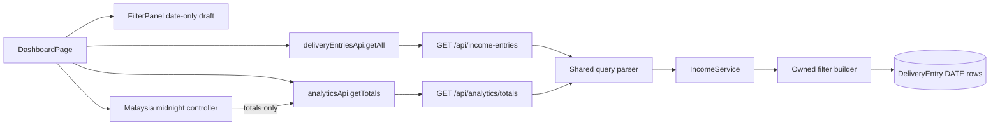

# Technical Design: Daily Malaysia Income Totals

## Overview

This feature changes dashboard reads, not stored delivery data. PostgreSQL already stores `DeliveryEntry.entryDate` as `DATE`; that value remains the sole day-membership authority. The backend will interpret API dates as strict `YYYY-MM-DD` civil dates, build host-timezone-independent half-open database ranges, and share one owned-record filter builder between entries and totals. Without an explicit date, totals receive a server-derived `Asia/Kuala_Lumpur` current date while entries retain their existing historical scope.

The implementation is deliberately narrow: update `IncomeService`, the existing income and analytics routes, the frontend API types/serialization, `FilterPanel`, and `DashboardPage`; add small date/filter and midnight-refresh helpers beside those modules. There is no Prisma migration, record backfill, destructive operation, or change to report/halal-or-not behavior.

### Goals

- Make stored `entryDate`, not `createdAt` or `timestamp`, authoritative for all dashboard date filtering.
- Apply explicit date, restaurant status, and payment filters identically to totals and the pre-pagination entry set.
- Keep entries historical when no explicit date exists while defaulting totals to the request-time Malaysian date.
- Include an inclusive selected end date without browser, server, or database host-timezone dependence.
- Refresh only default totals at Malaysian midnight with bounded retries, stale-value preservation, and deterministic test seams.
- Reject invalid date ranges and pagination before exposing data, while preserving ownership boundaries and all records.

### Non-goals

- Changing the `DeliveryEntry` schema, rewriting existing `entryDate` values, deleting/archive records, or altering CRUD semantics.
- Combining entries and totals into a new endpoint.
- Refreshing the historical entry list at midnight.
- Modifying `.kiro/specs/halal-or-not` or unrelated report functionality.

## Architecture


## Key Design Decisions

1. **Date-only at every dashboard boundary.** Filter state and API query parameters use `YYYY-MM-DD` strings. Neither `new Date("YYYY-MM-DD")` nor `toISOString()` participates in filter construction.
2. **One filter definition, two default scopes.** Totals and entries use the same explicit filter object and owned-record predicate. Only absent-date behavior differs: totals inject current Malaysian date; entries inject no date predicate.
3. **Half-open ranges.** A selected inclusive `[start, end]` is represented to Prisma as `entryDate >= start` and `entryDate < end + 1 calendar day`. Calendar addition occurs before conversion to a UTC carrier `Date`, so host timezone cannot truncate the end date.
4. **Backend request time is authoritative.** The server computes default totals date for each request using an injected clock and `Asia/Kuala_Lumpur`; the browser midnight timer only decides when to issue another date-less totals request.
5. **Fail closed for coordinated loads.** Initial, filter, and pagination loads wait for both endpoints. If either fails, neither newly fetched result is committed and both data regions are replaced by one error.
6. **Separate refresh semantics.** Midnight refresh calls totals only. Failure keeps the last complete totals visible, shows a refresh-specific error after the retry budget, and never clears or refetches entries.
7. **No storage migration.** Existing `DATE` values and indexes, including `(userId, entryDate)`, are sufficient. All new feature operations are reads.

## Components and Interfaces

### Date-Only Domain Utilities

Add a small backend module, for example `src/services/incomeQuery.ts`, containing pure functions and types:

```ts
type DateOnly = string; // validated YYYY-MM-DD Gregorian date
type PaymentType = "cash" | "digital" | "both";

interface ExplicitDateRange {
  startDate: DateOnly;
  endDate: DateOnly; // inclusive at the contract boundary
}

interface DashboardFilters {
  dateRange?: ExplicitDateRange;
  restaurantStatus?: "halal" | "non-halal";
  paymentType?: PaymentType;
}

interface Clock { now(): Date }
```

`parseDateOnly` must reject timestamps, impossible dates, overflow-normalized values, and noncanonical strings. A single supplied boundary is normalized to a one-day range by copying it to the absent boundary. If both exist, compare parsed civil-date values and reject `start > end`.

`currentMalaysiaDate(clock)` converts the injected instant to `Temporal.Instant`, then to `Asia/Kuala_Lumpur`, and returns the local `PlainDate`. The backend already has the pinned Temporal polyfill, so no dependency change is required.

`toPrismaDateRange(range)` converts each validated `PlainDate` to a UTC-midnight carrier with `Date.UTC(year, month - 1, day)`, and converts the end after `PlainDate.add({ days: 1 })`. UTC carriers are an adapter for Prisma/PostgreSQL `DATE`, not a reinterpretation of the stored day.

### Shared Owned Filter Builder

`buildOwnedEntryWhere(userId, filters, effectiveDateRange?)` returns one Prisma `DeliveryEntryWhereInput`:

```ts
{
  userId,
  ...(range && { entryDate: { gte: utc(range.startDate), lt: utc(dayAfter(range.endDate)) } }),
  ...(status && { restaurantStatus: status }),
  ...(paymentType === "cash" && { hasCashOrder: true }),
  ...(paymentType === "digital" && { hasCashOrder: false })
}
```

`userId` is mandatory and added before optional predicates. `both` contributes no payment predicate. Both `getEntries` and `calculateTotals` call this builder; route-specific hand-built date/status/payment clauses are removed.
### `IncomeService`

Keep the class and public result shapes, but make dependencies injectable with production defaults:

```ts
class IncomeService {
  constructor(private readonly clock: Clock = systemClock) {}

  getEntries(userId: string, query: EntryQuery): Promise<EntryPage>;
  calculateTotals(userId: string, filters: DashboardFilters): Promise<IncomeTotals>;
}
```

`getEntries` applies an explicit normalized range only when present. With no date range, it queries all historical owned rows matching non-date filters. It uses the exact same `where` for `count` and `findMany`, then orders by `entryDate desc`, `timestamp desc`, `id asc` before `skip` and `take`. The tie-breakers make the requested slice deterministic without discarding or changing records.

`calculateTotals` uses the explicit range when present; otherwise it creates a one-day range from `currentMalaysiaDate(clock)` at service invocation. It then applies status and payment through the same builder. Aggregation folds matching rows with `Prisma.Decimal` (or integer cents) rather than repeated binary floating-point addition:

- halal/non-halal: `fareAmount + (cashAmount ?? 0)` partitioned by status;
- cash: sum `cashAmount ?? 0` for every row in the already filtered set;
- digital: sum `fareAmount` for every row in the already filtered set.

The existing JSON response remains four numeric fields for client compatibility. An empty query result returns four zeros. No service read method calls create, update, delete, or raw mutation APIs.

### Query Parsing and Routes

Both `GET /api/income-entries` and `GET /api/analytics/totals` retain their paths and response shapes. Replace permissive ISO timestamp handling with shared strict date-only validation:

- `startDate`, `endDate`: optional canonical `YYYY-MM-DD` values;
- one boundary: one-day explicit range;
- both boundaries: inclusive normalized range, rejecting start after end;
- `restaurantStatus`: `halal | non-halal`;
- `paymentType`: `cash | digital | both`.

The analytics route must pass `paymentType` through to `calculateTotals`; it is no longer informational. If dates are absent it passes no date range, allowing service request-time defaulting. The entries route also passes no range when dates are absent, retaining historical behavior.

Entries additionally validate integer `limit` in `[1, 100]` and integer `offset` in `[0, 2147483647]`, with defaults `50` and `0`. Validation occurs before service invocation. Any malformed date, reversed range, or invalid pagination returns `400 { error: "Validation failed", details: [...] }` and performs no query. Service and route types replace `any` filter objects.

### Frontend API Contract

Use date-only wire types in `packages/frontend/src/services/api.ts`:

```ts
interface DashboardFilterQuery {
  startDate?: string;
  endDate?: string;
  restaurantStatus?: RestaurantStatus;
  paymentType?: "cash" | "digital" | "both";
}

analyticsApi.getTotals(filters?: DashboardFilterQuery, options?: { signal?: AbortSignal }): Promise<IncomeTotals>
deliveryEntriesApi.getAll(filters?: DashboardFilterQuery & Pagination, options?: { signal?: AbortSignal }): Promise<EntryPage>
```

The client appends date strings unchanged and adds `paymentType` for analytics. It must append numeric zero explicitly (`offset !== undefined`) rather than relying on truthiness. API errors remain rejected promises, but validation errors should preserve the server's safe message/details in a typed or normalized client error so the dashboard can distinguish filter/pagination validation from loading failures.
### `FilterPanel`

Keep native date inputs, but store and emit their existing string values instead of converting through JavaScript `Date`. Draft state is separate from applied state. On Apply:

1. Normalize a lone boundary to a single-day range.
2. If both boundaries exist and start is after end, notify the parent with an invalid-range result; do not issue API requests.
3. Otherwise emit canonical filters, including active status/payment values.

On invalid apply, `DashboardPage` removes the active explicit date range, retains non-date selections, and enters a fail-closed validation state that renders the range error in place of both totals and entries. Editing alone does not query. A subsequent valid Apply clears the validation state and automatically loads the corrected filters. Clear removes both date values, preserves no stale explicit range, and resets offset to zero.

### `DashboardPage` Coordinated Loading

Replace the single `loadData` responsibility with two paths:

- `loadDashboard(filters, pagination)`: initial/filter/pagination/delete load using `Promise.allSettled` for entries and totals. Commit both response snapshots only when both succeed. After both settle, any failure sets one dashboard-load error and hides both regions; filters, pagination state, last internal successful values, and storage remain unchanged.
- `refreshTotalsAtMidnight(filters)`: totals-only request used exclusively by the midnight controller. On success replace totals atomically; on failure leave the currently displayed totals and entries intact.

A monotonically increasing request generation and optional `AbortController` prevent late results from superseded filters, pagination, unmount, or a newly active explicit range from committing. Unauthorized handling remains unchanged. Filter selection/change/clear sets offset zero before the next request; page navigation alone retains its requested offset.

The dashboard view has explicit states:

```ts
type DashboardDataState =
  | { kind: "loading" }
  | { kind: "ready"; entries: EntryPage; totals: IncomeTotals }
  | { kind: "validation-error"; message: string }
  | { kind: "load-error"; message: string };
```

A refresh error is separate overlay/status state because stale complete totals must remain visible. Validation and coordinated load errors replace both totals and list content; they never display a partial response.

### Malaysian Midnight Controller

Add a pure date/scheduling utility and a small hook/controller, for example `useMalaysiaMidnightTotalsRefresh`. It receives `now`, timer functions, active filters, and a callback, making production clocks/timers replaceable in tests.

Frontend `malaysiaDateAt(instant)` uses `Intl.DateTimeFormat(..., { timeZone: "Asia/Kuala_Lumpur", year, month, day })` with `formatToParts`; it never reads host-local calendar fields. The next Kuala Lumpur midnight instant is computed from the Malaysian civil date using the zone's UTC+08:00 transition and rechecked when the timer fires. A `visibilitychange`/resume check compares the last observed Malaysian date and catches a throttled timer without polling entries.

The controller is active only when neither date boundary is applied. At a detected date change it invokes one totals request immediately. It never invokes the entries client. It serializes attempts so a request still pending after 60 seconds continues without an overlapping retry. On a rejected attempt, it schedules at most three retries, each 30 seconds after the preceding rejection; success cancels remaining timers and clears refresh error. Thus the maximum trace is initial attempt plus retries at the next three 30-second intervals. After the third retry rejects, it sets the refresh error synchronously (within the next render tick, under one second) and preserves stale totals.

Activating an explicit date, changing filters, unmounting, or beginning a newer generation cancels timers/aborts where possible and makes old completions noncommittable. With an explicit date active, no midnight timer changes totals scope. After clearing dates, the controller reestablishes default scheduling and the normal coordinated load obtains current-day totals plus historical entries.
## Data Models

### Existing Model and Invariants

No Prisma model or migration changes are required. Existing `DeliveryEntry.entryDate DateTime @db.Date` remains unchanged, as do identifiers and all field values.

Domain invariants:

- Every row belongs to the civil date stored in `entryDate`; `createdAt` and `timestamp` never appear in membership predicates.
- Every read predicate starts with authenticated `userId` and never accepts user identity from query parameters.
- Explicit range membership is `start <= entryDate < dayAfter(end)`; default totals membership is the same form with Malaysian today as both boundaries.
- Absent explicit dates mean no entry-list date predicate and exactly one current-Malaysia-day totals predicate.
- Status and payment predicates are conjunctive with ownership and date predicates.
- Count and page queries use the same predicate; pagination is applied only after deterministic ordering.
- Dashboard reads and midnight transitions cannot mutate the delivery table.
- A visible totals snapshot is replaced only by a complete successful totals response.

## Error Handling

| Condition | Backend behavior | Dashboard behavior |
|---|---|---|
| Invalid/noncanonical date | `400`, no service call | Validation error replaces totals and entries |
| Start after end | `400`, no query | Remove active date range; range error replaces totals and entries |
| Invalid limit/offset | `400`, no query | Pagination error replaces entries and totals; preserve filters/store |
| One coordinated request fails | Safe `4xx/5xx` | Wait for both; commit neither; show one load error |
| Midnight totals attempt fails | Safe rejection | Retry up to three times; retain complete stale totals and entries |
| All midnight attempts fail | No data mutation | Show refresh error after final rejection; retain stale totals |
| Request remains pending >60 seconds | Keep request alive | No overlap or premature error; continue until settlement |
| Superseded response arrives | Normal response | Ignore by generation; never mix filter generations |
| Unauthorized | Existing `401` | Clear token and redirect as today |

The dashboard must not infer success from one half of a coordinated load. Server validation is authoritative even though the frontend validates for immediate feedback.

## Testing Strategy

Use the repository's existing Vitest, Testing Library, Supertest, `fast-check`, and Temporal dependencies; no new test dependency is needed. Property tests run at least 100 cases and include comments/tags in the form `Feature: daily-malaysia-income-totals, Property N: ...`.

### Unit and Property Tests

- Pure date utilities: strict parsing, Gregorian validity, Malaysian date at instants around 16:00 UTC, UTC-carrier conversion, inclusive end plus one day, and host-`TZ` independence.
- Pure filter builder/reference model: arbitrary owners, dates, statuses, payment states, and `createdAt` values; assert exact set equality and ownership isolation.
- Aggregation: generated scale-two decimals, empty sets, both statuses/payment modes, null cash as zero, and exact four-card folds.
- Pagination: generated ordered sets and valid/invalid boundaries; assert count, stable slice, and no service call on invalid input.
- Dashboard reducer/controller: filter changes reset offset, page navigation preserves offset, invalid ranges fail closed, and stale generations cannot commit.
- Midnight controller with `vi.useFakeTimers()` and an injected clock: no-date versus explicit-date behavior, totals-only calls, +30/+60/+90 retry traces, cancellation on success/filter/unmount, stale values, delayed unresolved promises, and visibility catch-up.

### Route and Integration Tests

- Supertest both endpoints with identical explicit filters and assert identical service filter contracts, including `paymentType`.
- Database-backed integration tests seed multiple users and boundary dates, then assert exact owned totals, historical default entries, inclusive selected end dates, count-before-pagination, ordering, and unchanged row snapshots before/after successful and failed reads.
- Frontend integration tests mock both APIs to verify coordinated fail-closed loading, corrected-range reload, clear-to-default scopes, and analytics date/payment serialization.
- Retain targeted regression tests for existing CRUD, delete refresh, report UI, and authentication behavior. Run backend/frontend targeted tests, TypeScript builds, and Prisma validation; no migration test is expected because the schema is unchanged.

## Correctness Properties

*A property is a characteristic or behavior that should hold true across all valid executions of a system—essentially, a formal statement about what the system should do. Properties bridge human-readable requirements and machine-verifiable correctness guarantees.*

### Redundancy Review

The testability prework found substantial overlap. Entry-date dominance subsumes the backdated example; one exact filter-set model subsumes separate date/status/payment membership checks; one four-card fold subsumes individual total formulas; and one pagination model subsumes count, slice, length, and ordering. Default scope separation remains distinct from explicit-range equality because their entry-list date semantics intentionally differ. Midnight behavior is represented as one state-machine property rather than separate timer properties. Storage, ownership, and fail-closed presentation remain separate because none implies the others.

### Property 1: Entry Date Dominance

For any Delivery Entry and any changes made only to its `createdAt` or `timestamp`, the entry belongs to exactly the one civil day stored in `entryDate`, including when that day precedes the Malaysian day containing `createdAt`.

**Validates: Requirements 1.1, 1.2**

### Property 2: Default Malaysian-Day Totals

For any request instant, authenticated user, active non-date filters, and finite Delivery Entry set, a totals request without explicit dates equals the exact aggregation of owned entries whose stored `entryDate` is the `Asia/Kuala_Lumpur` civil date at that instant and that satisfy every non-date filter; local midnight is included and the next local midnight is excluded regardless of host timezone.

**Validates: Requirements 1.3, 1.4**

### Property 3: Inclusive Explicit Date Selection

For any valid single date or ordered inclusive date range, authenticated user, active non-date filters, and Delivery Entry set, totals and the pre-pagination entry list select identical record identifiers: exactly the owned records satisfying every filter whose stored `entryDate` lies on or between the boundaries; changing a previously invalid range into such a range makes that corrected selection the next applied selection.

**Validates: Requirements 2.1, 2.2, 2.8**

### Property 4: Conjunctive Filter Composition

For any combination of explicit dates, restaurant status, payment type, ownership, and Delivery Entry records, each matching set contains a record if and only if it satisfies every predicate applicable to that request, with `cash` selecting exactly `hasCashOrder=true`, `digital` selecting exactly `hasCashOrder=false`, and `both` adding no payment restriction; all four totals are folded only from that resulting set.

**Validates: Requirements 2.4, 2.5, 3.3, 3.4, 3.5, 4.1, 4.2, 4.3**

### Property 5: Default Scope Separation and Restoration

For any authenticated user, Delivery Entry set, active non-date filters, and prior explicit range, removing all explicit dates yields a pre-pagination entry set containing all owned historical records satisfying the non-date filters, a totals set containing only owned current-Malaysia-day records satisfying those same filters, and an entry request offset of zero.

**Validates: Requirements 3.1, 3.2, 3.6, 3.7**

### Property 6: Exact Four-Card Aggregation

For any payment-filtered matching set of scale-two monetary records, halal and non-halal totals equal the exact `fareAmount + (cashAmount ?? 0)` folds for their respective status partitions, cash total equals the exact `cashAmount ?? 0` fold, and digital total equals the exact `fareAmount` fold; this remains true for cash-only records, and the empty set yields four numeric zeros.

**Validates: Requirements 2.7, 4.4, 4.5, 4.6, 4.7, 4.8, 4.9**
### Property 7: Malaysian Midnight Refresh State Machine

For any simulated Malaysian date transition, active filter state, request settlement sequence, and timer progression, the controller issues an immediate totals-only refresh exactly when no explicit date is active, preserves an explicit date scope otherwise, never changes the historical entry-list scope, runs no more than three retries 30 seconds after preceding failures, stops after success, preserves the last complete totals through failures, exposes an error immediately after the final failed retry, and permits a still-pending request to settle without overlapping attempts or a 60-second cancellation.

**Validates: Requirements 5.1, 5.2, 5.3, 5.4, 5.5, 5.6, 5.7**

### Property 8: Storage Invariance Under Reads and Day Changes

For any initial Delivery Record Store state, sequence of successful or failed dashboard read operations, and simulated Malaysian day transitions, the final multiset of Delivery Entry identifiers and field values equals the initial multiset.

**Validates: Requirements 6.1, 6.2, 6.3**

### Property 9: User Isolation Before All Other Operations

For any two distinct authenticated users and any mixed-owner Delivery Entry set, each user's totals and entry page equal the corresponding reference result formed by removing all other owners before date/status/payment filtering, counting, ordering, aggregation, or pagination.

**Validates: Requirements 6.4, 6.5**

### Property 10: Pagination Consistency and Bounds

For any filtered pre-pagination entry set, limit from 1 through 100, and offset from 0 through 2147483647, the reported total equals the full set size and the returned page equals the deterministic ordered slice with length `min(limit, max(0, total - offset))`; for any value outside those bounds, validation performs no data query, exposes no entries, and leaves active filters and stored rows unchanged.

**Validates: Requirements 6.6, 6.7, 6.8, 6.9, 6.11**

### Property 11: Filter-Change Pagination Transition

For any valid current offset and sequence of dashboard actions, selecting, changing, or clearing any filter makes the next entry request use offset zero, while pagination navigation without an intervening filter action uses the requested valid offset.

**Validates: Requirements 3.9, 6.10**

### Property 12: Invalid or Inconsistent Loads Fail Closed

For any reversed explicit range, the dashboard removes that active date range and renders a validation error instead of totals and entries without issuing a data query; and for any coordinated load in which either endpoint fails or filters cannot be applied identically, the dashboard waits for requested operations to settle, commits neither new result, and exposes one error instead of partial, stale-scope, or unfiltered data while retaining filter, pagination, and stored-record state.

**Validates: Requirements 2.3, 2.6, 3.8**

## Implementation Impact Summary

Expected production changes are limited to:

- backend date/filter helper(s), `IncomeService.ts`, `routes/income.ts`, and `routes/analytics.ts`;
- frontend date-only filter types/serialization in `FilterPanel.tsx` and `services/api.ts`;
- coordinated load and midnight totals controller behavior in `DashboardPage.tsx` plus a small pure helper/hook;
- targeted tests beside those modules and one database integration test suite.

No Prisma migration, data rewrite, endpoint replacement, dependency addition, or modification to the existing halal-or-not spec/code is part of this design.
